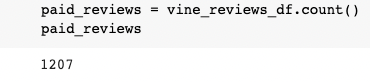
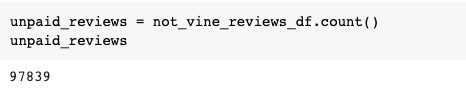
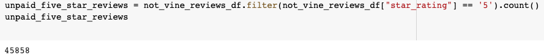
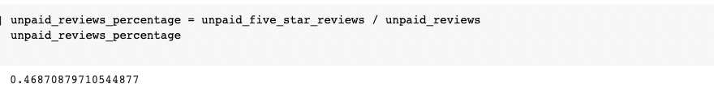

# Amazon_Vine_Analysis
## Overview of the Analysis
The purpose of this analysis is to review writen reviews done Amazon Vine. Amazon Vine is a program where you pay a small fee to have them review your products. We are going to compare the reviews of the products that were paid for against the one that were not. In the end we are going to see if it is worth paying for the servises.
## Resulsts
  1. How many Vine reviews and non-Vine reviews there are.
    
  Total Vine
  
  
    
    
  Total non-Vine
    
  
    
  2. How many Vine and non-Vine reviews were 5 stars.
    
  Vine 5 star
    
  
    
    
  Non-Vine 5 star
  
  
    
    
  3. What percentage of Vine and non-Vine reviews were 5 stars.
  
  Vine 5 star percentage
  
  
    
  Non-Vine 5 star percentage
    
  
   
## Summary 
After looking at the data it does not look like there is bais in the Vine program. When you look at the data it looks like they actual only give 5 stars on 42% of the compared to the non-Vine at 47%. The big thing to keep in mind here is that there is alot more non-Vine reviews than there are Vine. To take this a step further i would want to look at the number of non-Vine reviews where from the people that actual used it. We could do more filtering by the verified purchase.
